# TrackPro

**TrackPro** is a comprehensive fitness app designed to help individuals track their health and fitness efficiently. Whether you own a smartwatch or not, TrackPro offers a wide range of features to monitor physical activity, health metrics, and progress toward your fitness goals.

## Problem Statement

Currently, individuals seeking to track their health and fitness rely on separate tools or manual tracking methods, which can be inefficient. Many users struggle to monitor their physical activity, workout progress, and health metrics in a streamlined way, often leading to gaps in data, inconsistent tracking, and challenges in setting meaningful fitness goals. 

Additionally, users without a smartwatch have limited capabilities for tracking detailed health data, while smartwatch users often lack a comprehensive platform that integrates all their health and fitness data in one place.

## Solution: TrackPro

To address these challenges, **TrackPro** was developed. The app aims to provide an easy-to-use and efficient solution for all users, regardless of whether they own a smartwatch. 

For users without a smartwatch, the app will offer features such as:
- Workout routines
- Step tracking
- Real-time location and weather updates

For smartwatch owners, **TrackPro** will offer advanced capabilities like:
- Heart rate tracking
- Oxygen level tracking
- Delivering more in-depth health insights

By integrating all these features into a single platform, **TrackPro** will empower users to stay on top of their fitness journey, improve their health, and achieve their personal goals more effectively.

## Technologies Used

This project leverages several powerful technologies to build and manage the app efficiently:

- **Flutter**: Used for building the mobile app's cross-platform interface.
- **Squareline Studio**: A design and UI development tool for building smooth and intuitive smartwatch user interfaces.
- **Firebase**: Used for authentication, real-time database, and cloud storage for user data and app content.
- **Arduino**: Integrated with the app to provide sensor data (such as heart rate, oxygen levels, steps, temperature, pressure, and humidity) from Arduino-based devices to the app.
## Smartwatch and Sensor Integration

The **TrackPro** app is designed to work seamlessly with the **LilyGo T4S3 AMOLED** smartwatch, which is connected to a variety of sensors for real-time data collection. The smartwatch acts as a bridge between the sensors and the app, delivering valuable health insights directly to the user.

### **LilyGo T4S3 AMOLED Smartwatch**
The **LilyGo T4S3 AMOLED** is a powerful smartwatch equipped with an AMOLED display for a smooth and vibrant user experience. This smartwatch serves as the primary wearable device for the TrackPro app, providing real-time health data directly on your wrist.

### **Connected Sensors**:

To enhance the fitness tracking experience, the **LilyGo T4S3 AMOLED** smartwatch is integrated with the following sensors:

1. **Heart Rate Sensor (MAX30105)**:
   - The **MAX30105** sensor measures heart rate and SpO2 (oxygen saturation) levels in real-time, providing accurate and continuous monitoring of the user's cardiovascular health.

2. **Motion Sensor (MPU6050)**:
   - The **MPU6050** is a gyroscope and accelerometer that tracks the user's movement, enabling step counting, motion detection, and activity recognition.

3. **Temperature and Humidity Sensor (SHT31)**:
   - The **SHT31** sensor measures the ambient temperature and humidity levels, helping users understand the environment around them while monitoring their physical activity.

4. **Pressure Sensor (BMP280)**:
   - The **BMP280** sensor measures atmospheric pressure, which can be used to detect altitude changes, useful for tracking activities like hiking or running in different terrains.

By integrating these sensors, the **TrackPro** app provides comprehensive health insights and enables advanced fitness tracking, from step count to heart rate and environmental data.

## App Screenshots

Here’s a glimpse of the app's user interface:

  
  

  
  

  
  

  
  

  
  

  
  

  
  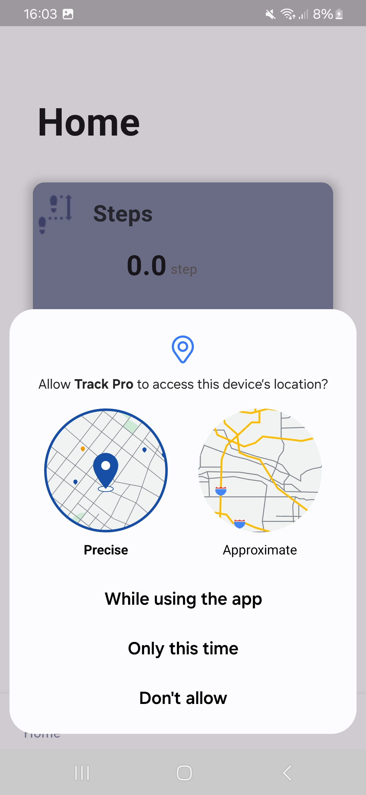

  
  

  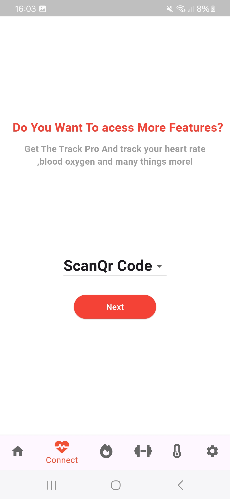
  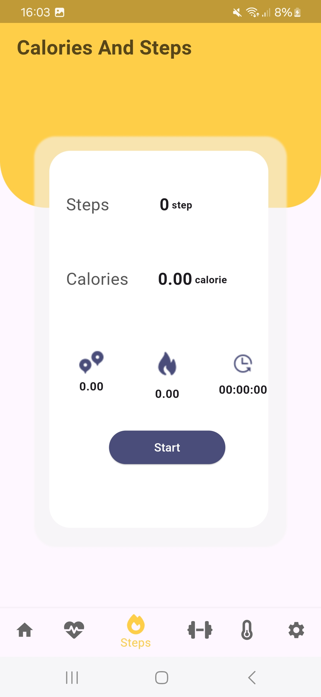

  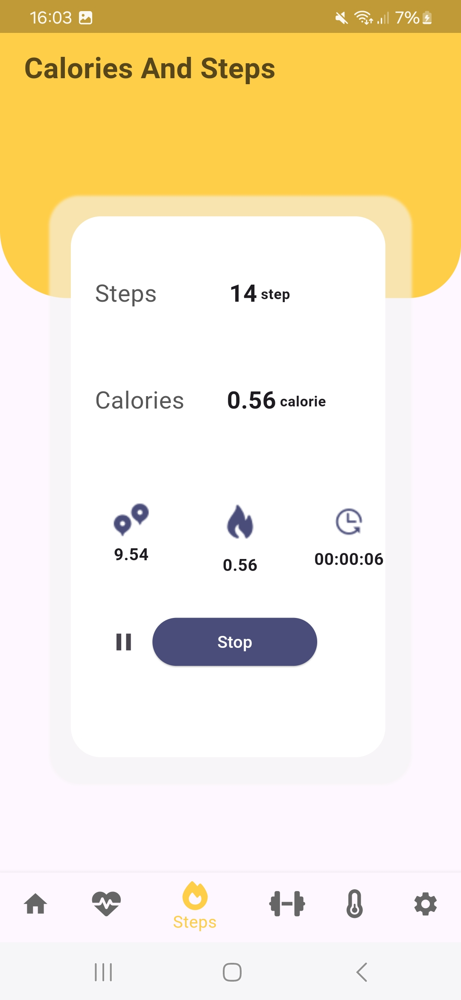
  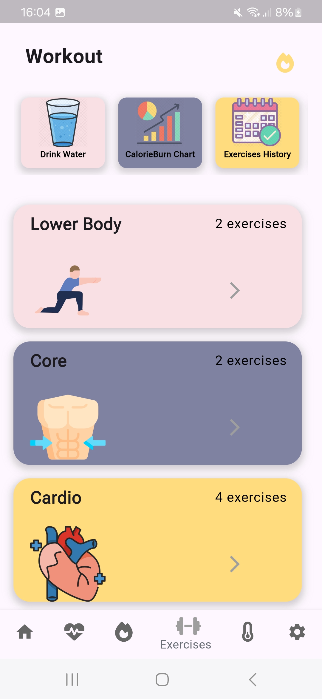

  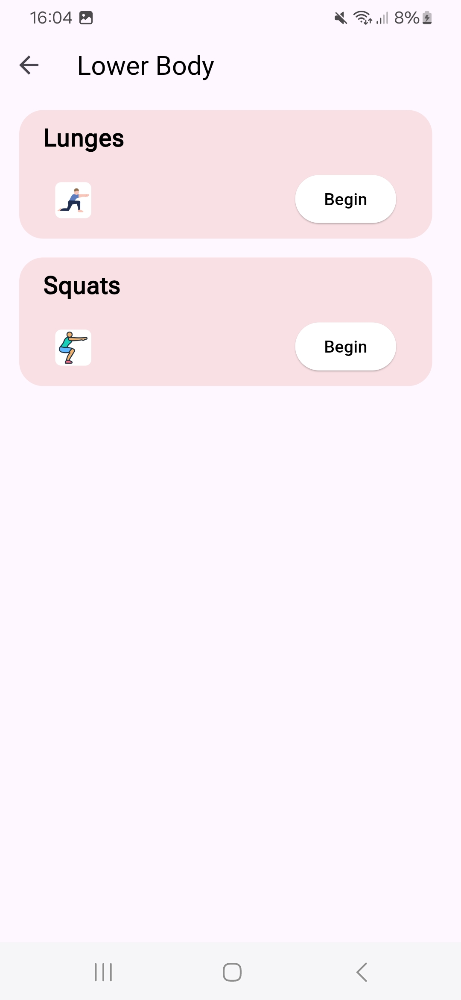
  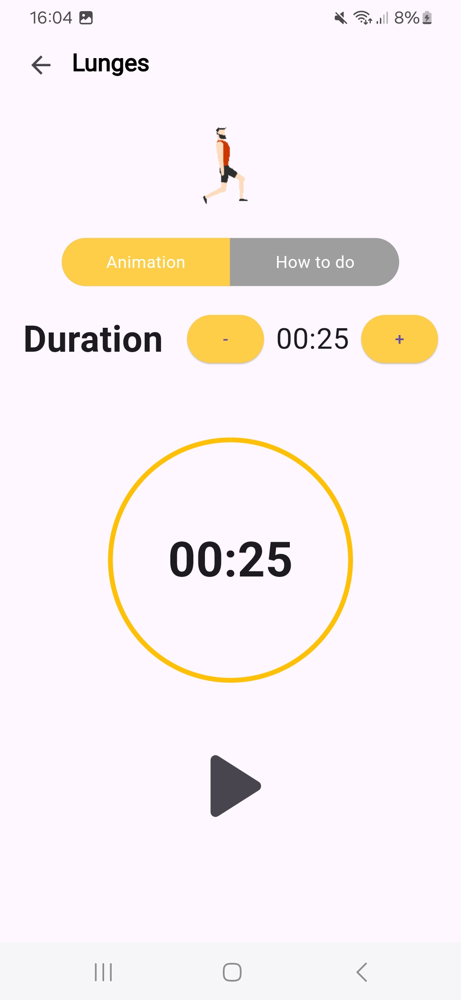

  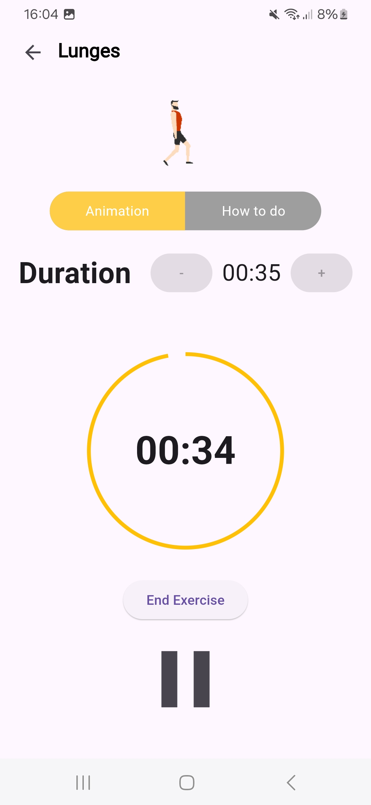
  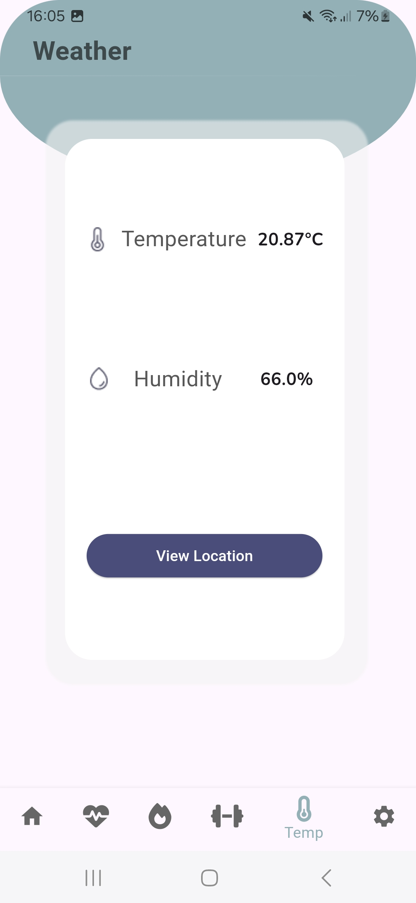

  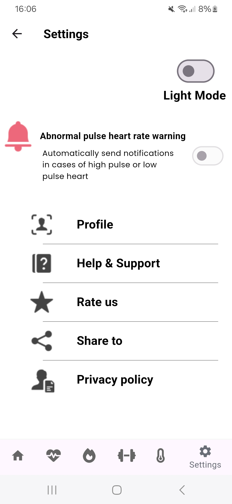
  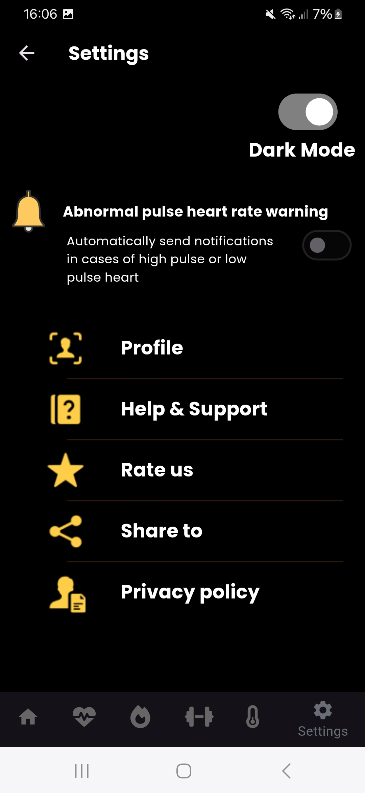

  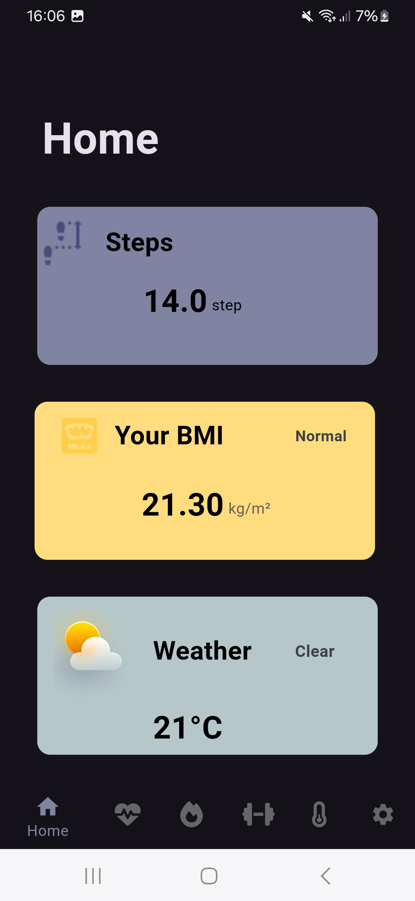
  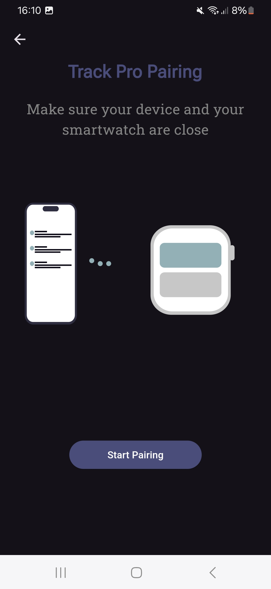

  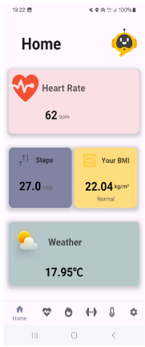
  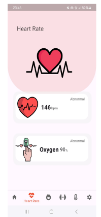

  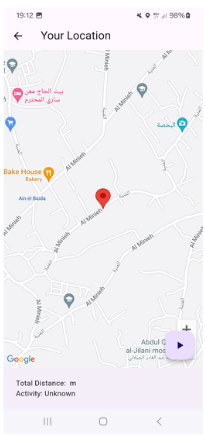
  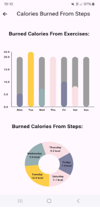

## Smartwatch Screenshots

Here are some screenshots of the **TrackPro** smartwatch:

  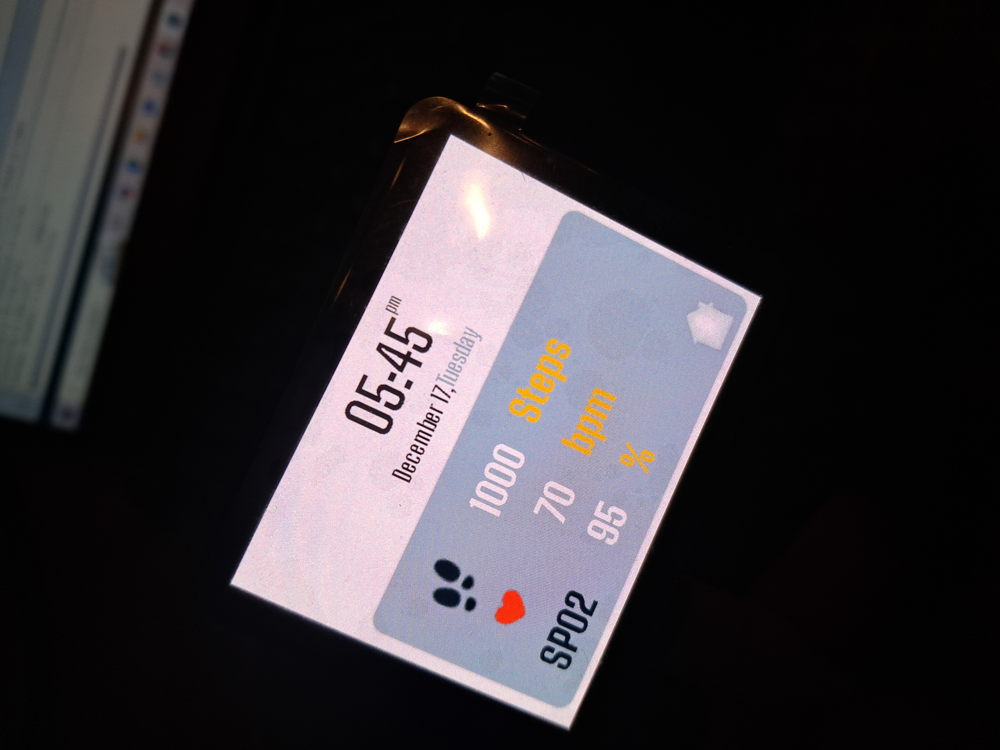
  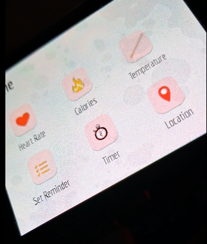

  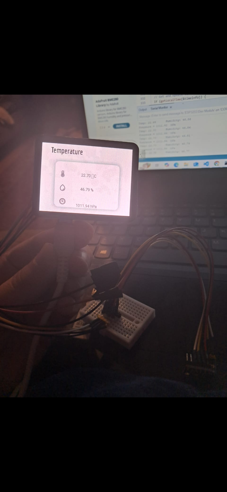

