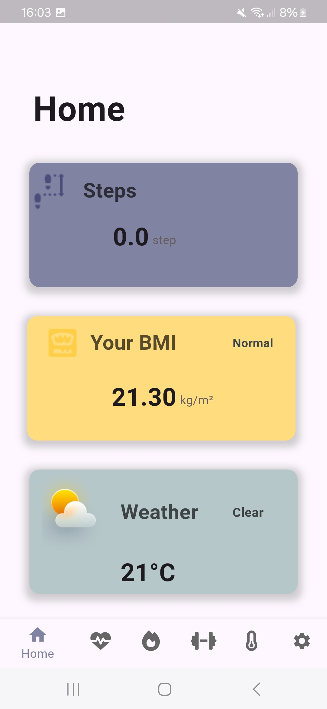

# TrackPro

**TrackPro** is a comprehensive fitness app designed to help individuals track their health and fitness efficiently. Whether you own a smartwatch or not, TrackPro offers a wide range of features to monitor physical activity, health metrics, and progress toward your fitness goals.

## Problem Statement

Currently, individuals seeking to track their health and fitness rely on separate tools or manual tracking methods, which can be inefficient. Many users struggle to monitor their physical activity, workout progress, and health metrics in a streamlined way, often leading to gaps in data, inconsistent tracking, and challenges in setting meaningful fitness goals. 

Additionally, users without a smartwatch have limited capabilities for tracking detailed health data, while smartwatch users often lack a comprehensive platform that integrates all their health and fitness data in one place.

## Solution: TrackPro

To address these challenges, **TrackPro** was developed. The app aims to provide an easy-to-use and efficient solution for all users, regardless of whether they own a smartwatch. 

For users without a smartwatch, the app will offer features such as:
- Workout routines
- Step tracking
- Real-time location and weather updates

For smartwatch owners, **TrackPro** will offer advanced capabilities like:
- Heart rate tracking
- Oxygen level tracking
- Delivering more in-depth health insights

By integrating all these features into a single platform, **TrackPro** will empower users to stay on top of their fitness journey, improve their health, and achieve their personal goals more effectively.

## App Screenshots

Here’s a glimpse of the app's user interface:

  
  

  
  

  
  

  
  

  
  

  
  

  
  

  
  

  
  

  
  

  
  

  
  

  
  

  
  

  
  

  
  

